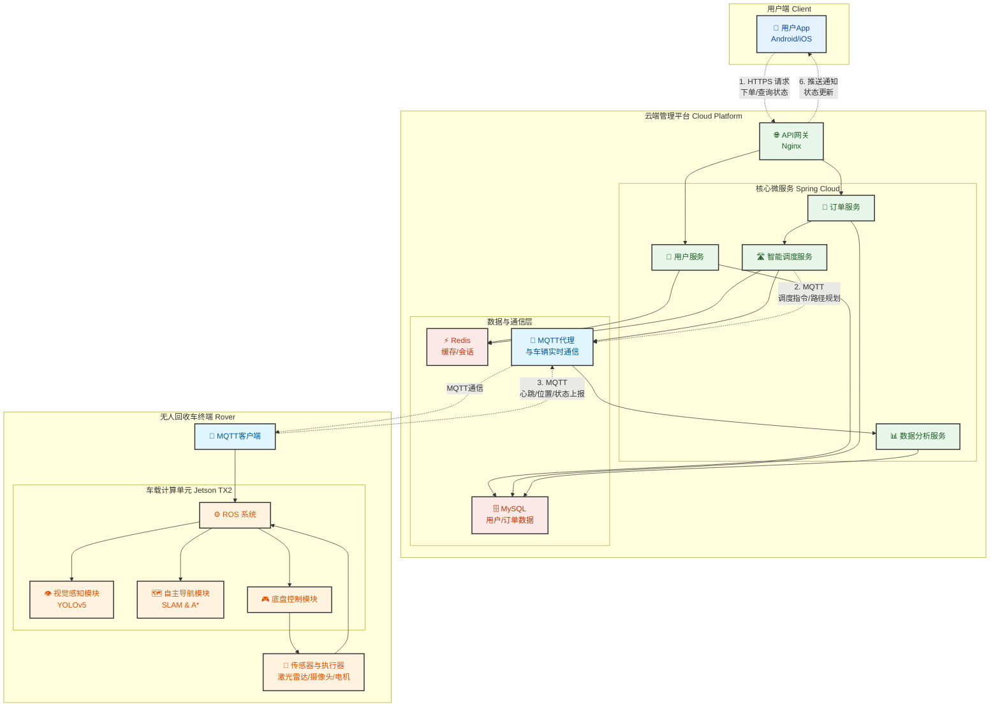

# RecycleRover: 基于无人车的小区智能废品回收与激励平台


**RecycleRover** 是一个面向智慧社区的创新项目，旨在通过**无人驾驶回收车**、**智能视觉识别**和**即时激励机制**，解决传统废品回收中存在的“最后一公里”难题。本项目是北京交通大学大学生创新创业训练计划支持项目。

---

## 目录

- [项目愿景](#-项目愿景)
- [✨ 核心功能](#-核心功能)
- [🏗️ 系统架构](#️-系统架构)
- [🛠️ 技术栈](#️-技术栈)
- [🚀 快速开始](#-快速开始)
- [📂 项目结构](#-项目结构)
- [📸 Demo演示](#-demo演示)
- [🤝 贡献指南](#-贡献指南)
- [👥 团队成员](#-团队成员)
- [📜 开源许可](#-开源许可)
- [🙏 致谢](#-致谢)

## 🔭 项目愿景

在快节奏的城市生活中，传统废品回收模式面临诸多挑战：回收点分散、分类效率低下、居民参与感不强。**RecycleRover** 致力于改变这一现状，我们希望：

-   **提升居民回收便利性与参与度**：用户足不出户，一键呼叫，让废品回收像叫外卖一样简单，并通过积分系统即时获得回报。
-   **降低社区运营成本，实现数据化管理**：用自动化的无人车替代部分人力，并通过云端平台精准统计回收数据，为社区环保决策提供支持。
-   **助力循环经济发展**：通过提高前端分类的准确率和回收效率，从源头上提升可回收资源的价值，为绿色、低碳的社区生活贡献一份力量。

## ✨ 核心功能

本项目由用户端App、无人车终端和云端管理平台三部分构成，实现了“回收-积分-兑换”的激励闭环。

-   📱 **用户端 (App)**
    -   **一键呼叫**：用户通过App随时随地呼叫无人回收车上门。
    -   **实时追踪**：在地图上实时查看无人车位置与预计到达时间。
    -   **智能识别**：用户投放后，App即时显示废品类别与重量。
    -   **积分商城**：回收获得的积分可用于兑换商品或社区服务。
    -   **环保档案**：记录用户的回收历史和碳减排贡献。

-   🤖 **无人车终端 (Rover)**
    -   **自主导航与避障**：基于激光雷达SLAM技术，在小区复杂环境中实现L4级自主导航和动态避障。
    -   **高精度废品识别**：搭载轻量化 **YOLOv5** 视觉模型，精准识别纸类、塑料瓶、金属罐等5大类常见废品，准确率 >95%。
    -   **自动称重与分类**：内置称重传感器和分类隔舱，实现全自动处理。
    -   **实时通信**：与云端平台保持实时通信，上报状态并接收调度指令。

-   ☁️ **云端管理平台**
    -   **智能调度系统**：根据订单位置和车辆状态，实现多车辆的全局最优路径规划与调度。
    -   **数据可视化大屏**：实时监控所有无人车状态、回收订单量、各类废品回收统计等关键指标。
    -   **用户与积分管理**：统一管理用户信息和积分账户体系。
    -   **区块链存证 (规划中)**：利用区块链技术确保积分流转的公开透明与不可篡改。

## 🏗️ 系统架构




系统采用“端-云-车”三层架构：
1.  **用户端 (Client)**：负责用户交互与服务请求。
2.  **云端平台 (Cloud)**：作为系统的“大脑”，负责业务逻辑处理、数据存储、智能调度和监控。
3.  **无人车终端 (Vehicle)**：作为执行单元，负责物理世界的感知、决策和执行。

三者通过 RESTful API 和 MQTT 协议进行高效通信。

## 🛠️ 技术栈

| 模块           | 主要技术                                                                        |
| :------------- | :------------------------------------------------------------------------------ |
| **无人车终端** | **硬件**: Jetson TX2, 激光雷达, 深度摄像头 <br> **OS**: ROS (Robot Operating System) <br> **算法**: SLAM, A*, YOLOv5, CNN <br> **语言**: Python, C++ |
| **云端平台**   | **后端**: Spring Boot, Spring Cloud <br> **数据库**: MySQL, Redis <br> **消息队列**: RabbitMQ <br> **DevOps**: Docker, Nginx |
| **用户端App**  | **平台**: Android & iOS <br> **框架**: Flutter / React Native / Uniapp (或原生开发) |
| **通用**       | **版本控制**: Git <br> **协作工具**: GitHub, Figma |

## 🚀 快速开始

### 环境依赖

-   Python 3.8+
-   PyTorch 1.10+
-   ROS Noetic
-   Java 11 & Maven
-   Node.js & Flutter SDK
-   ... (请补充其他关键依赖)

### 安装与运行

1.  **克隆仓库**
    ```bash
    git clone https://github.com/[你的用户名]/RecycleRover.git
    cd RecycleRover
    ```

2.  **无人车终端配置**
    详细步骤请参考 [`rover/docs/SETUP.md`](rover/docs/SETUP.md)。
    ```bash
    # 示例启动命令
    roslaunch rover_main startup.launch
    ```

3.  **云端平台部署**
    详细步骤请参考 [`cloud/docs/SETUP.md`](cloud/docs/SETUP.md)。
    ```bash
    # 示例启动命令
    cd cloud
    mvn spring-boot:run
    ```

4.  **移动端App构建**
    详细步骤请参考 [`app/README.md`](app/README.md)。
    ```bash
    # 示例启动命令
    cd app
    flutter run
    ```

## 📂 项目结构

```
RecycleRover/
├── README.md                    # 项目主说明文档
├── .gitignore                   # Git忽略文件配置
└── waste_detection/             # 废品图像识别模块 🎯
    ├── README.md                # 模块详细说明
    ├── requirements.txt         # Python依赖包
    ├── dataset/                 # 数据集管理
    │   ├── images/             # 图像数据(train/val/test)
    │   ├── labels/             # YOLO格式标注文件
    │   └── data_utils.py       # 数据集处理工具
    ├── config/                  # 配置文件
    │   ├── waste_data.yaml     # 数据集配置
    │   ├── model_config.yaml   # 模型配置
    │   └── training_config.yaml # 训练参数配置
    ├── models/                  # 模型定义和权重
    ├── scripts/                 # 训练和推理脚本
    │   ├── train.py            # 模型训练脚本
    │   ├── evaluate.py         # 模型评估脚本
    │   ├── inference.py        # 实时推理脚本
    │   └── export.py           # 模型导出脚本
    ├── utils/                   # 工具函数
    │   ├── __init__.py         # 常量和类别定义
    │   ├── visualization.py    # 结果可视化
    │   ├── metrics.py          # 性能指标计算
    │   └── deployment.py       # 部署工具
    └── deployment/              # 部署配置
        ├── jetson_setup.md     # Jetson TX2安装指南
        ├── tensorrt_config.py  # TensorRT优化配置
        └── inference_service.py # 部署服务脚本
```

### 🎯 废品检测模块特性

- **支持5类废品识别**: 塑料瓶、纸箱、金属罐、玻璃瓶、废纸
- **高精度检测**: mAP@0.5 目标 >95%
- **轻量化设计**: YOLOv5s模型 <15MB
- **边缘部署优化**: 针对Jetson TX2优化，支持TensorRT加速
- **实时处理**: 目标 >30 FPS
- **完整工具链**: 从数据准备到模型部署的完整解决方案
